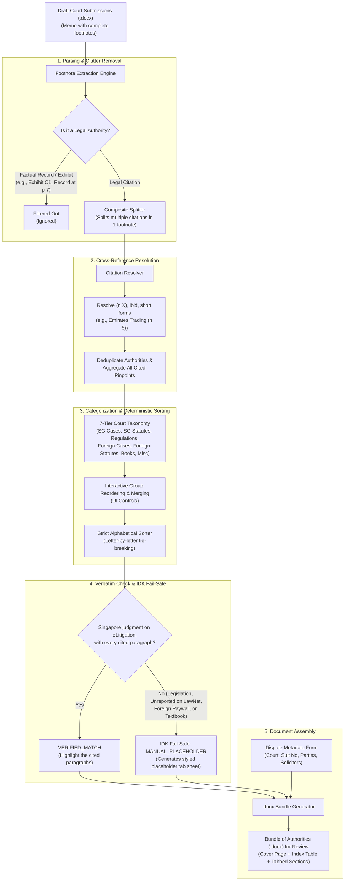

# Bundle of Authorities (BOA) Autobot

[](LICENSE)
[](https://www.python.org/downloads/)
[](#)

> **"The goal of technology is to kill tedious, low-value work — unlocking human capacity for what truly matters: strategic thinking, zealous advocacy, and servicing the client's needs."**

---

## 💡 The Mission & Philosophy

Every litigation associate and trainee knows the dreaded late-night ritual before a court filing deadline: sitting in the office at 2 AM, manually parsing through hundreds of footnotes in a draft submission, separating factual trial exhibits from case citations, chasing down obscure backward references like `(n 7)` and `ibid.`, sorting dozens of authorities alphabetically by hand, and hunting for pinpoint paragraphs to highlight in yellow.

This is **unbillable, soul-crushing, and error-prone manual labour**. 

Clients do not hire lawyers to format tables and alphabetize case names — they hire lawyers to solve complex problems, build winning arguments, and protect their interests. 

The **Bundle of Authorities (BOA) Autobot** was created to eliminate this manual drudgery. By combining **hard deterministic code** with a strict **zero-hallucination legal triage protocol**, the Autobot transforms raw draft submissions (`.docx`) into a beautifully formatted Bundles of Authorities in seconds.

---

## 🎬 Trailer

<p align="center">
  <a href="trailer/trailer.mp4">
    
  </a>
</p>

<p align="center"><sub>▶ Click the preview for the full-quality video with sound (<code>trailer/trailer.mp4</code>, 23 s).</sub></p>

---

## 🌟 Key Features

### 1. Deterministic Footnote Extraction & Factual Filter
- Directly parses OpenXML footnotes from your draft `.docx`.
- **Factual Evidence Filter**: Automatically separates procedural and factual trial citations (`Claimant Exhibit C1`, `Respondent Exhibit R2`, `Record at pp 21–23`, `Notice of Arbitration`, `Affidavit of...`) from genuine legal authorities.
- **Composite Footnote Splitter**: Cleanly disentangles complex footnotes citing multiple authorities across semicolons and conjunctions (`See also...`, `; and...`).

### 2. Intelligent Cross-Reference Resolution
- Automatically resolves backward pointers such as `(n 7)`, `(n 5)`, `ibid.`, `supra`, and defined short-names:
  - *Example*: Maps `Emirates Trading (n 5)` back to its primary root: `Emirates Trading Agency LLC v Prime Mineral Exports Pte Ltd [2015] 1 WLR 1145`.
- **Deduplication & Pinpoint Aggregation**: Consolidates authorities cited multiple times across the brief into a single Index tab while aggregating all referenced pinpoints (`[63]–[64]`, `[27]`, `[40]`, `s 30(1)(c)`, `Order 15 rule 10`).

### 3. 7-Tier Categorization & Deterministic Alphabetical Sorting
- **Default Singapore Court Taxonomy**:
  1. **Singapore Cases** (*SGCA, SGHC, SGDC, SGSTB, SLR*)
  2. **Singapore Statutes** (*Acts of Parliament*)
  3. **Regulations & Statutory Instruments** (*Rules of Court, SIAC Rules, Subsidiary Legislation*)
  4. **Foreign Cases** (*UKSC, EWCA, EWHC, WLR, All ER, AC, Ch*)
  5. **Foreign Statutes** (*UK Arbitration Act, UK Misrepresentation Act*)
  6. **Secondary Sources** (*Textbooks like Cavinder Bull's Singapore Civil Procedure, Law Journals*)
  7. **Miscellaneous** (*Soft law, practice notes, catch-all*)
- **Interactive Grouping**: Reorder groups with 1 click or combine groups (e.g. merge Foreign Cases & Foreign Statutes into *"Foreign Authorities"*, or Statutes & Regulations into *"Statutes & Statutory Instruments"*).
- **Strict Letter-by-Letter Tie-Breaking**: Compares word-by-word, character-by-character (`casefold()`) to guarantee mathematically reproducible alphabetical order.

### 4. Verbatim Judgment Checks on eLitigation
- **Zero LLM Generation Policy**: Under no circumstances does an AI hallucinate or autocomplete statutory sections or case judgments from model weights. No judgment or statute text is typed into the code: the only text that reaches a bundle is text fetched from eLitigation during the check.
- **Deterministic Citation & Paragraph Verification**: Singapore judgments with a neutral citation (e.g. `[2020] SGCA(I) 02`) are fetched from eLitigation. A judgment is used only if its header carries the cited neutral citation and every cited paragraph (`[63]`, `[63]-[64]`) exists as one of the judgment's own numbered paragraphs, so a paragraph number that only appears inside a quotation from another judgment never counts.
- **Legislation isn't looked up yet**: Singapore statutes and subsidiary legislation get placeholder sheets until a Singapore Statutes Online reader is built.

### 5. The "IDK" Fail-Safe Protocol & LawNet Reality Check
- **The Legal Reality**: Many Singapore decisions (unreported judgments, oral grounds, historical tribunal decisions) are strictly paywalled behind **LawNet** subscriptions. Foreign cases and commercial textbooks are similarly paywalled on ICLR, Westlaw, or LexisNexis.
- When an authority cannot be verified on eLitigation (or isn't a Singapore judgment), the system executes an honest **"IDK" Fail-Safe**:
  - Emits `MANUAL_PLACEHOLDER` with a clear explanation.
  - Automatically compiles a standardized **Placeholder Tab Sheet** in the `.docx` complete with the exact citation, category, and cited pinpoints, instructing the trainee or paralegal on which pages to slot in.

### 6. Native Word Output (`.docx`)
- Strictly builds native Microsoft Word (`.docx`) files matching Singapore Supreme Court and State Courts Practice Directions:
  - **Cover Page**: Court header, Case / Summons No., "In the matter of...", Parties with UEN, Document Title, Date, and 2-column Solicitors table.
  - **Index Table**: 2 columns (`TAB` | `DESCRIPTION`), category headers, full citations and pinpoints.
  - **Tab Dividers & Highlighting**: Distinct `Tab-1`, `Tab-2` dividers with **yellow pinpoint highlighting** (`<w:highlight w:val="yellow"/>`) on exactly the cited paragraphs of a verified judgment.

### 7. Privacy-First by Design
- Your draft never leaves your machine: footnotes are read locally and the upload is deleted as soon as it has been read. Built bundles are deleted from the server folder once they have been downloaded.
- Only citations are sent anywhere, and only when you click **Check Singapore Judgments on eLitigation**: the tool then requests each Singapore judgment's page from eLitigation.
- The page itself loads Tailwind CSS and Google Fonts from the internet.

---

## 🧑‍⚖️ What Is It Like to Use? (For Lawyers — No Tech Jargon)

If you are a lawyer, associate, or practice trainee, you don't need to understand code or APIs to use this tool. Here is what your day-to-day workflow looks like:

### 1. Upload Your Normal Draft
You write your court submissions, skeletal arguments, or legal memo in Microsoft Word (`.docx`) just like you always do, citing your cases and statutes in footnotes. You don't need to format anything specially. Simply upload your draft to the Autobot's local webpage.

### 2. The Tool Cleans Up Your Citations Automatically
- **It ignores factual exhibits**: You don't have to delete citations like `Claimant Exhibit C1 at Clause 9.2` or `Record at p 22`. The tool knows they are factual trial records and ignores them automatically.
- **It untangles cross-references**: If you cited `Emirates Trading (n 5) [63]` or `ibid.`, the tool automatically connects it back to the original full neutral citation.
- **It deduplicates authorities**: If you cited *Emirates Trading* ten times across different footnotes, the tool groups all those citations together, collects all your cited pinpoints (`[63]`, `[27]`, `[40]`), and ensures the case only appears **once** in your Index with a single Tab number.

### 3. Review & Customize on Screen
- **Fill in the Case Cover Page**: Type your Case Number (e.g. `DC/OA XXX/YYYY`), parties' names, UEN numbers, and law firm contact blocks directly into simple input boxes on your screen.
- **Rearrange Groups with One Click**: The tool automatically groups your authorities according to Singapore court standards (Singapore Cases $\rightarrow$ Singapore Statutes $\rightarrow$ Regulations $\rightarrow$ Foreign Cases $\rightarrow$ Foreign Statutes $\rightarrow$ Books). If your partner prefers Statutes first, or wants Foreign Cases and Statutes combined into a single *"Foreign Authorities"* section, just click the **Move Up / Move Down** or **Combine** buttons.
- **Deterministic Alphabetical Order**: You never have to manually alphabetize a list of 50 cases again. The tool sorts every authority character-by-character with exact tie-breaking.

### 4. Zero-Hallucination Retrieval & The "IDK" Safety Net
- **Official Singapore Judgments**: For Singapore judgments with a neutral citation, the tool fetches the grounds of decision from eLitigation, checks that every paragraph you cited is really there, and applies **yellow highlights** to exactly those paragraphs. Compare the eLitigation text with the law report version before you file.
- **Legislation**: Statutes and subsidiary legislation aren't looked up yet; each gets a placeholder sheet for you to fill from Singapore Statutes Online.
- **Honest Placeholders for Paywalled Cases**: If a case is unreported on LawNet, or is an English case behind a Westlaw/ICLR paywall, the tool **never makes up text**. Instead, it generates a clean, labeled **Placeholder Tab Page** with the exact pinpoint and instructions, telling your trainee: *"Insert official report from LawNet here; highlight [63]-[64] in yellow"*.

### 5. Download Your Word Document
Click **"Download Bundle of Authorities (.docx)"**. In seconds, you have a complete Microsoft Word document with:
1. Formal Court Cover Page
2. Formatted Index Table (`TAB` | `DESCRIPTION`)
3. Section Tabs (`Tab-1`, `Tab-2`, ...) with verbatim highlighted law and structured placeholder sheets.

If you want to make any last-minute tweaks, you can edit the resulting Word document directly in Microsoft Word.

---

## 📊 Data Pipeline & System Architecture



---

## 🚀 Quick Start

### 1. Requirements & Installation
Ensure you have Python 3.10+ installed.

```bash
git clone https://github.com/iz911/Bundle-of-Authorities-Autobot.git
cd Bundle-of-Authorities-Autobot
pip install -r requirements.txt
```

### 2. Configure Environment (`.env`)
Copy the provided `.env.example` template:
```bash
copy .env.example .env
```
Default ports configured:
- **Web App Port**: `2345` (`http://localhost:2345`)
- **Local Model Runner**: Port `11434` (Ollama) or Port `1234` (LM Studio)

### 3. Launch Local Web App
Run the launcher script or python server:
```bash
# On Windows:
run.bat

# Or via terminal:
python app.py
```

Open your browser to:
👉 **[http://localhost:2345](http://localhost:2345)**

---

## 🤖 Local Model Configuration (Optional)

The header shows whether a local, OpenAI-compatible model server is reachable. The engine doesn't use it to write anything yet (one-line proposition summaries are planned), so the Autobot works fully without one:
- **Ollama**: Run `ollama run llama3.2` (Default port `11434`)
- **LM Studio**: Start local inference server on port `1234`
- **vLLM / LocalAI**: Start on port `8000` or `8080`

In `.env`:
```ini
LOCAL_MODEL_ENABLED=true
LOCAL_MODEL_BASE_URL=http://localhost:11434/v1
LOCAL_MODEL_PORT=11434
LOCAL_MODEL_NAME=llama3.2
```
When summaries are added, the model will run under a strict **"IDK" System Prompt**: if it cannot determine the legal proposition with certainty from the text, it must return `IDK` rather than guess.

---

## 🖥️ User Workflow in 5 Steps

```
┌────────────────────────────────────────────────────────┐
│ 1. Upload Draft (.docx)                                │
│    Upload your brief or click "Load Example Memo".     │
├────────────────────────────────────────────────────────┤
│ 2. Dispute Metadata Form                               │
│    Review/edit Court, Suit No, Parties, and Counsel.   │
├────────────────────────────────────────────────────────┤
│ 3. Group Arrangement                                   │
│    Reorder groups with ▲/▼ or toggle category merging. │
├────────────────────────────────────────────────────────┤
│ 4. Triage Authorities                                  │
│    Review pinpoints; check judgments on eLitigation.   │
├────────────────────────────────────────────────────────┤
│ 5. Export BOA (.docx)                                  │
│    Download your Bundle of Authorities for review.     │
└────────────────────────────────────────────────────────┘
```

---

## 🧪 Automated Test Suite

Run the full automated test suite covering all modules (eLitigation is faked, so it runs offline):
```bash
pip install pytest httpx
python -m pytest
```

| File | Covers |
| --- | --- |
| `tests/test_extractor.py` | Footnote extraction and evidence filtering |
| `tests/test_resolver.py` | Cross-reference resolution and pinpoint aggregation |
| `tests/test_sorter.py` | Alphabetical sorting and group merging |
| `tests/test_verifier.py` | Verbatim verification and IDK fallback handling |
| `tests/test_checking.py` | eLitigation lookups, paragraph checks and exact highlighting |
| `tests/test_generator.py` | `.docx` generation and yellow highlights |
| `tests/test_api.py` | End-to-end FastAPI endpoints |

Tests that read the private example memo are skipped when it isn't present.

---

## ⚖️ License

This project is licensed under the **GNU Affero General Public License v3 (AGPL-3.0)** — see the [`LICENSE`](LICENSE) file for details.

## 🏆 Using This for a Hackathon?

You're welcome to fork or build on top of the BOA Autobot for hackathons, demos, or personal projects. Just make sure to credit the original repo and author:

- Repo: [github.com/iz911/Bundle-of-Authorities-Autobot](https://github.com/iz911/Bundle-of-Authorities-Autobot)
- Author: [@iz911](https://github.com/iz911)

Please keep this attribution visible in your submission (README, slides, or credits page) alongside compliance with the AGPL-3.0 license above.
